# 基于Springboot校园资料分享平台

## Springboot-0048


## 技术栈

Springboot mybatisplus vue mysql maven


## 数据库表(11张)


## 功能介绍

```properties
管理员功能有个人中心，学生管理，资料分享管理，资源分类管理，举报反馈管理，系统管理等。

用户功能有注册登录，个人中心，我的收藏，资料评论等
```


## 图片

### 前台

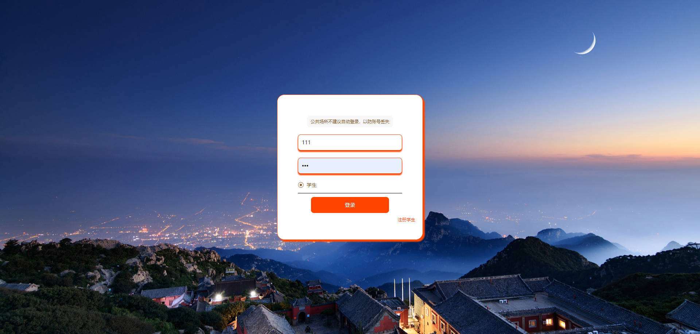

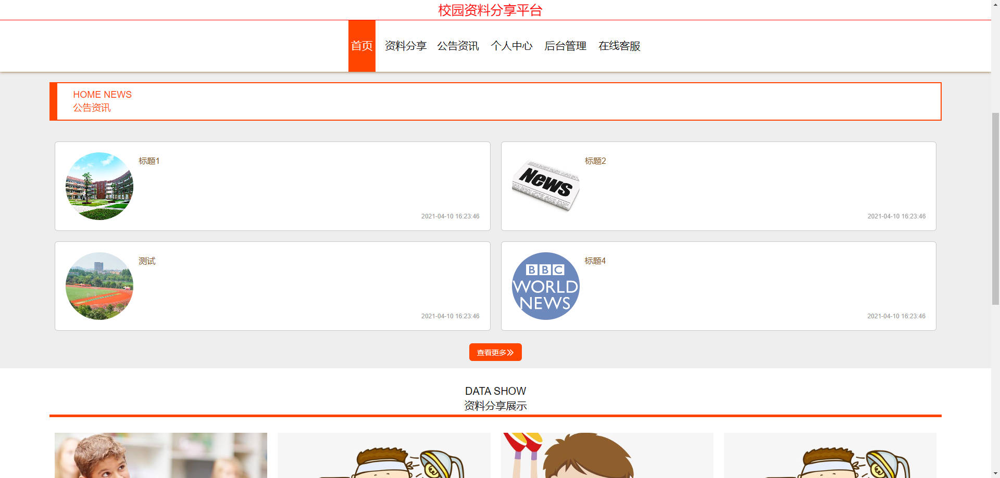


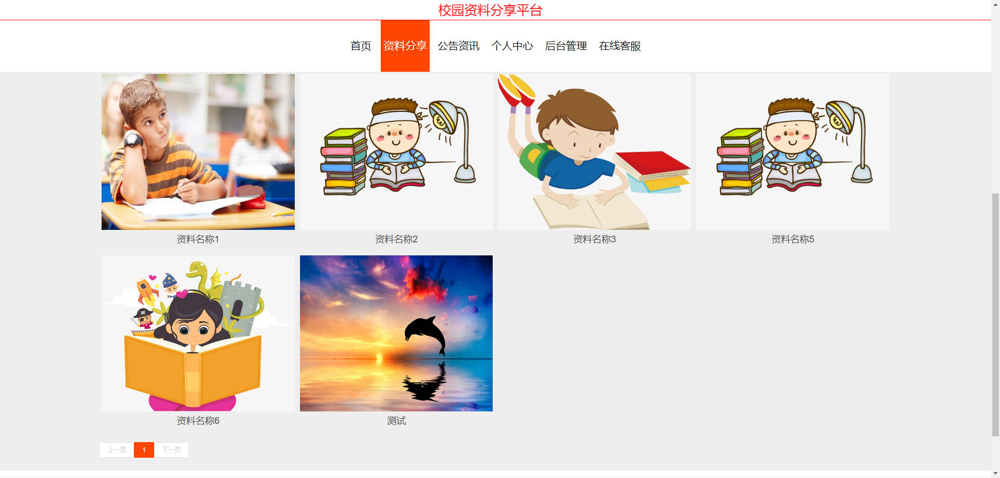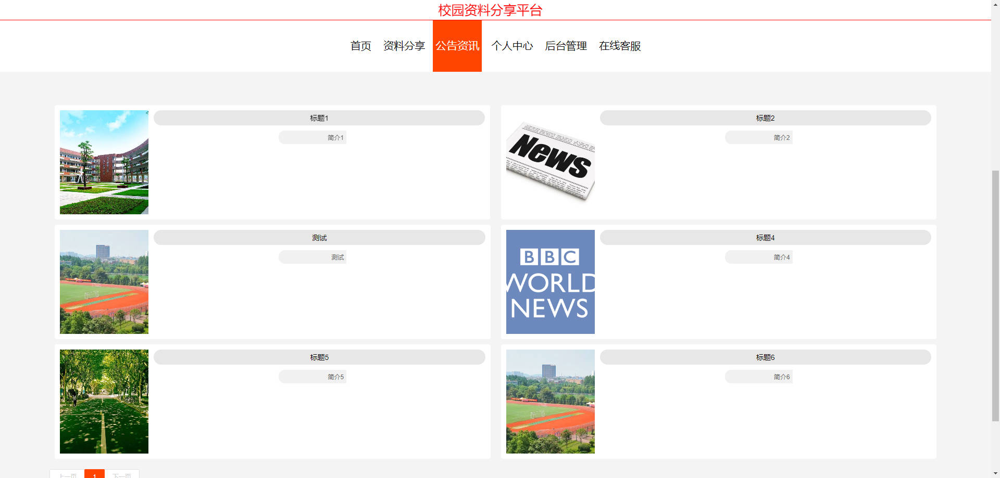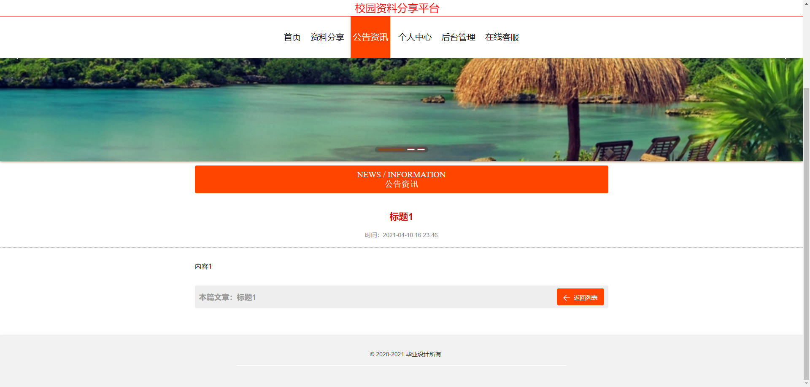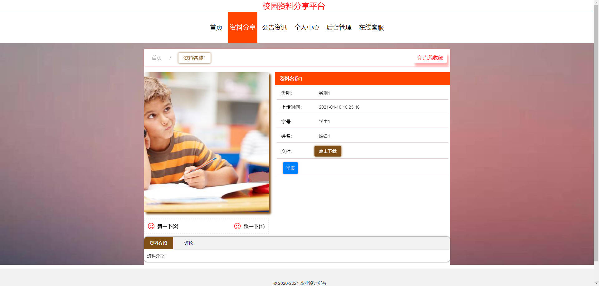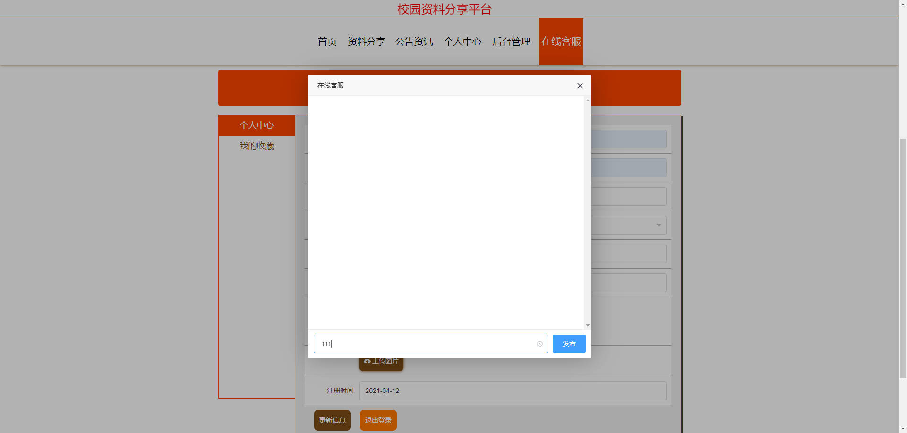

### 后台

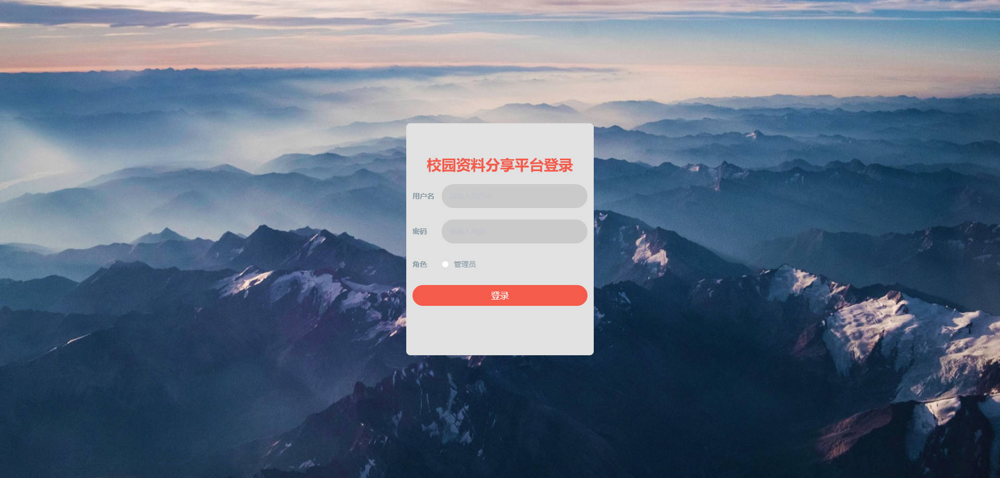

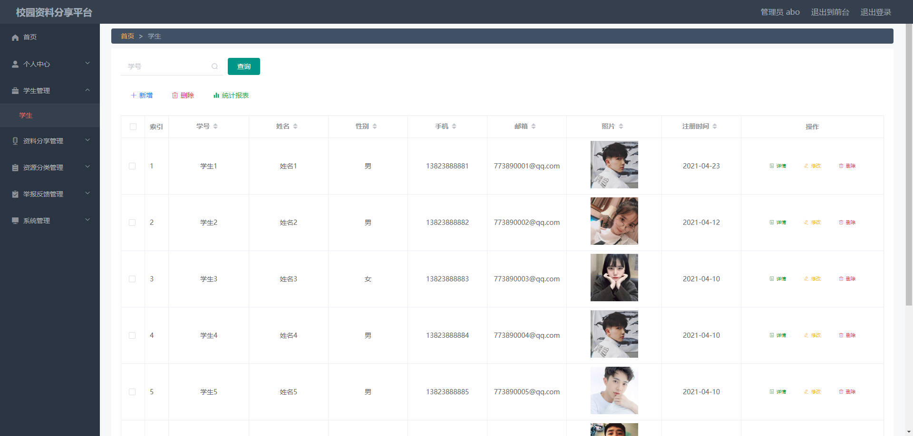

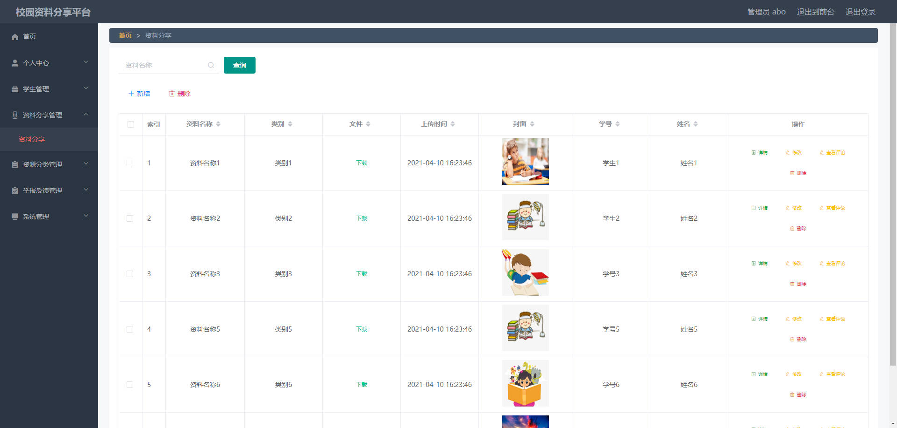

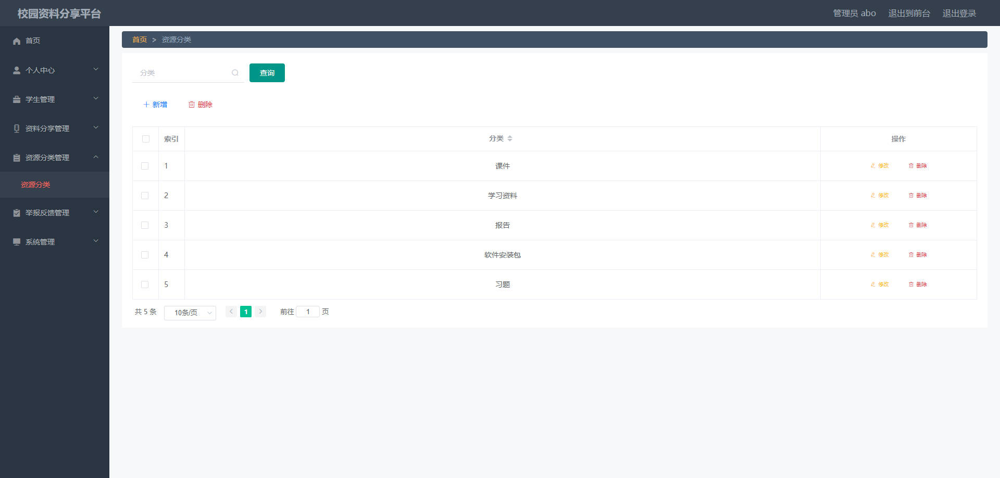

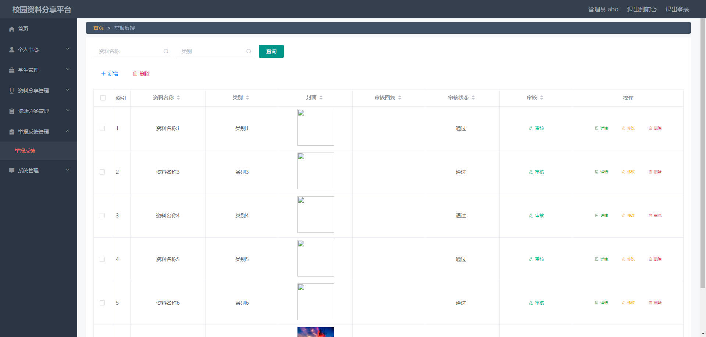


## 访问路径

### 前台

```properties
http://localhost:8080/springboot2mc6m/front/pages/login/login.html

账号 111
密码 111
```

### 后台

```properties
http://localhost:8080/springboot2mc6m/admin/dist/index.html#/login

账号 abo
密码 abo
```


## 功能图

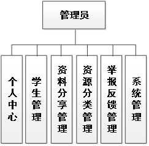

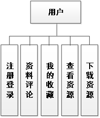

## 文档目录

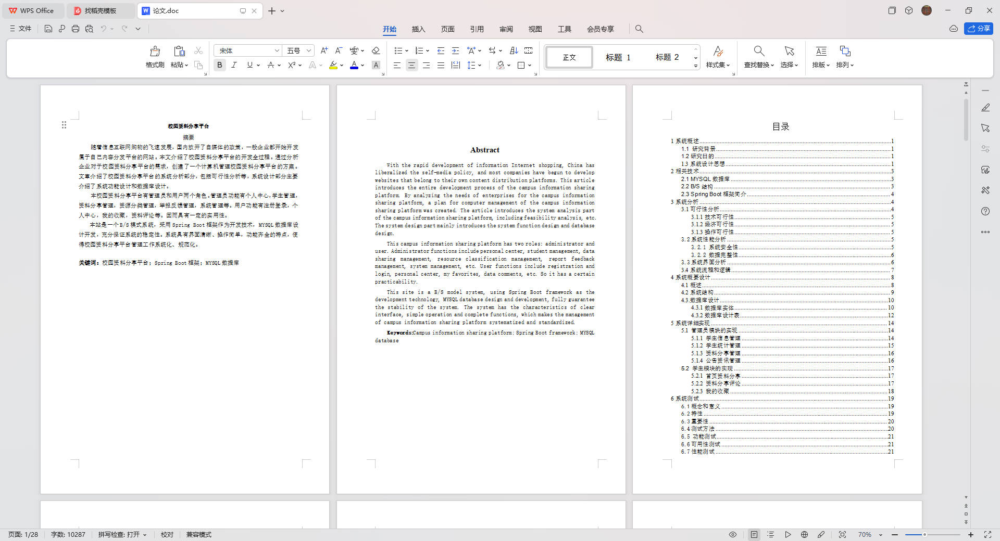


## 打赏或交流


